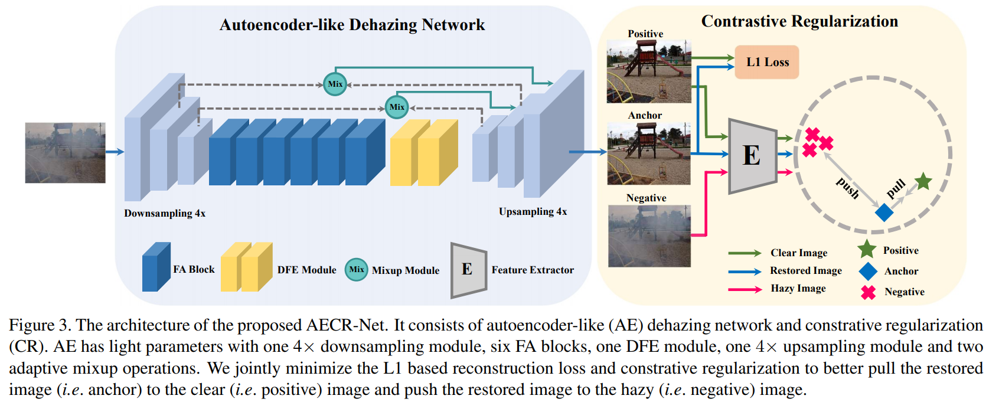
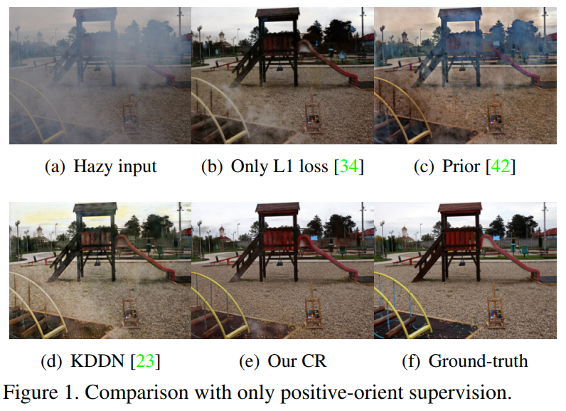
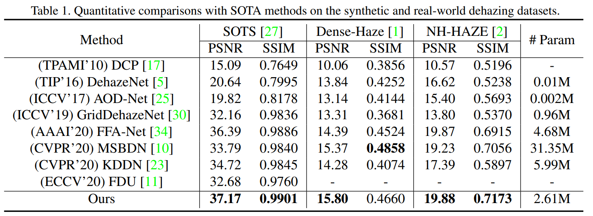

# AECR-Net

Contrastive Learning for Compact Single Image Dehazing, CVPR2021. Official Pytorch based implementation. 

## Paper

[arxiv](https://arxiv.org/abs/2104.09367)

### Pytorch Version

- [x] model
- [x] CR loss
- [x] pretrained models

### MindSpore Version

https://github.com/Booooooooooo/AECRNet-MindSpore by @wyb

## Performance

## Others

**Pretrained models:**

https://pan.baidu.com/s/13crsXwwhkI5A3MlHtPihuA  password: xhyi
